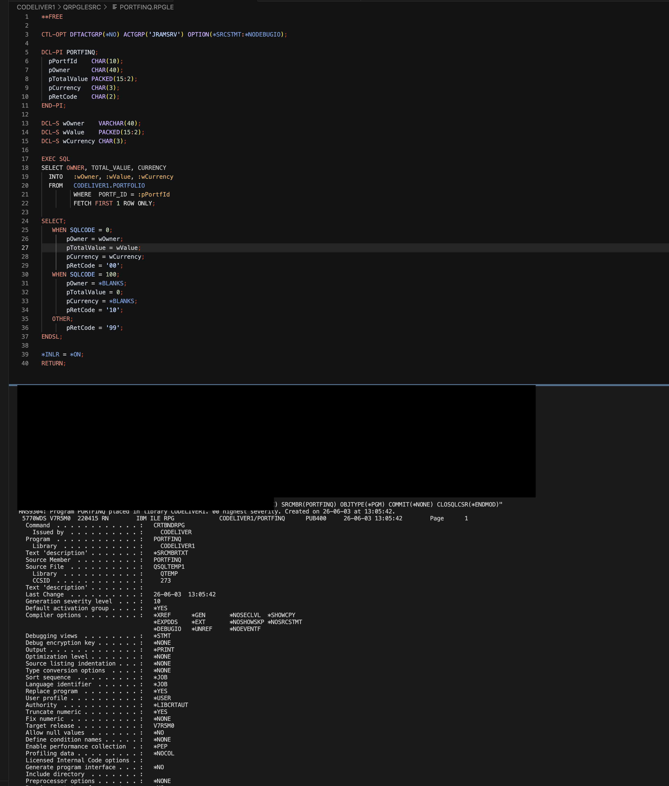

# Compiling RPGLE from VS Code for IBM i

Version: 1.00  
Source format: Markdown adaptation of a local Word document

## Purpose

This note records a successful RPGLE compilation with embedded Db2 for i SQL from a VS Code-oriented setup on IBM i.

## What Was Proven

- Connected to an IBM i environment from a local development machine.
- Used a terminal-driven IBM i command flow compatible with a VS Code workflow.
- Compiled an RPGLE source member containing embedded SQL.
- Produced a successful program object from the source member.

## Compile Command

The compile used `CRTSQLRPGI`:

```text
CRTSQLRPGI
  OBJ(CODELIVER1/PORTFINQ)
  SRCFILE(CODELIVER1/QRPGLESRC)
  SRCMBR(PORTFINQ)
  OBJTYPE(*PGM)
  COMMIT(*NONE)
  CLOSQLCSR(*ENDMOD)
```

## Outcome

The compile completed successfully for an RPGLE program with embedded Db2 for i SQL.

The screenshot keeps the compile result and IBM i component names visible. Black highlights hide local login/password terminal text.


